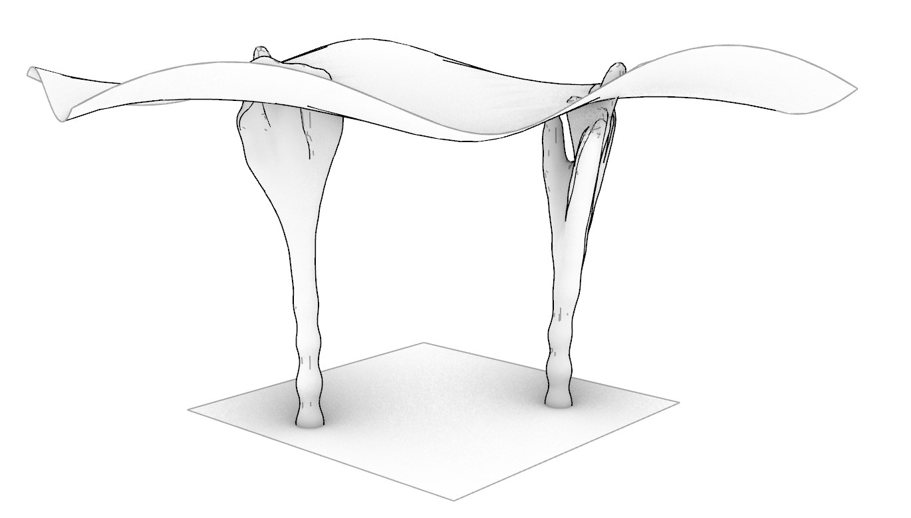

# Assignment 3: Parametric Structural Canopy Documentation

## Table of Contents

- [Pseudo-Code](#pseudo-code)
- [Technical Explanation](#technical-explanation)
- [Design Variations](#design-variations)
- [Challenges and Solutions](#challenges-and-solutions)
- [References](#references)

---

## Pseudo-Code

### Pseudocode for Tree Branching and Canopy Generation

#### Function: Create Branch
```
FUNCTION create_branch(start_point, direction, level, angle_range, length_range, max_levels, target_height):
    IF level > max_levels:
        RETURN empty list of branches, endpoint adjusted towards target_height

    INITIALIZE branches as empty list
    INITIALIZE end_points as empty list

    SET branch_length = random value within length_range
    CALCULATE end_point using start_point and scaled direction vector

    ADD line from start_point to end_point to branches

    SET num_branches = random value (2 or 3)

    FOR each child branch:
        CALCULATE random angle within angle_range
        GENERATE random rotation axis
        ROTATE direction vector using angle and axis
        NORMALIZE the resulting vector

        CALL create_branch recursively with updated parameters
        ADD returned branches and endpoints to respective lists

    RETURN branches and end_points
```

#### Main Program
```
INITIALIZE start_point as (x)
INITIALIZE initial_direction as (0, 0, 1)
SET angle_range to (-45, 45)
SET length_range to (2.0, 5.0)
SET max_levels to 5
SET target_height to 20.0

CALL create_branch with initial parameters

OUTPUT branches (lines representing tree structure)
OUTPUT end_points (outermost branch endpoints)
```

### Key Operations:
1. Recursive Function:
   - Generates tree structure by dividing branches into smaller sub-branches.

2. Randomization:
   - Introduces natural variability in angles, lengths, and branch counts.

3. Rhino Integration:
   - Adds branches as lines to the Rhino environment for visualization.

4. Termination:
   - Stops recursion when the maximum branching level is reached, ensuring controlled depth.


### Example Structure:

The structure of the original code can be explained using the provided pseudocode as a reference:

### **Comparison of Structure**

1. **Recursive Function:**
   - Both the original code and the pseudocode center around a recursive function, `create_branch`, which generates branches at each level until the maximum depth is reached.
   - The recursive structure is defined by:
     - **Base Case:** Stops recursion when the level exceeds `max_levels`.
     - **Recursive Case:** Creates child branches by calling `create_branch` with updated parameters.

2. **Initialization:**
   - The pseudocode outlines the initialization of variables like `branches` and `end_points`, directly mirroring the original code’s use of empty lists to store line data and endpoints.

3. **Randomized Parameters:**
   - Both emphasize the use of randomization for:
     - Branch lengths (`branch_length`).
     - Angles of rotation (`angle_range`).
     - Number of child branches (`num_branches`).
   - This randomness simulates the organic nature of tree structures.

4. **Vector Operations:**
   - The pseudocode highlights the calculation of `end_point` using the start point and scaled direction vector, a direct representation of operations in the original code like `rs.PointAdd` and `rs.VectorScale`.

5. **Main Program Flow:**
   - The pseudocode captures the overall program structure:
     1. Set up initial parameters (`start_point`, `initial_direction`, ranges, etc.).
     2. Call the recursive function with these parameters.
     3. Output the results for further use or visualization.
   - This flow matches the original code’s setup and the final `branches` and `end_points` outputs.

6. **Key Operations Integration:**
   - **Recursive Tree Generation:** Both the pseudocode and original code rely on recursion for hierarchical growth.
   - **Randomization:** Both introduce variability for natural aesthetics.
   - **Output:** Both generate outputs for Rhino visualization (`branches` as lines and `end_points` for endpoints).


---

## Technical Explanation

This project involves designing a canopy supported by 2 L-system-inspired branching tree structures given by 2 points. Using Rhino and Python scripting, a base surface is generated to serve as the foundation for the canopy. The branching tree structure is created through a recursive algorithm that simulates natural growth patterns, defined by parameters such as branch length, angle variation, and hierarchical levels. The tree's endpoints connect to a canopy surface, forming a unified structure. Both the tree and the canopy are converted into meshes, ensuring compatibility with digital fabrication and visualization workflows. This approach balances organic aesthetics with computational precision.

### Topics to Cover:

- **Depth Map Generation**
  - Explain how you manipulated the surface geometry.
  - Discuss the mathematical functions used (e.g., sine, cosine).
  - Describe how control parameters affect the depth variations.

- **Surface Tessellation**
  - Describe the tessellation strategies implemented.
  - Explain how tessellation contributes to the canopy design.
  - Discuss any algorithms or techniques used for non-uniform tessellation.

- **Recursive Supports Generation**
  - Explain how recursion was used to create complex support structures.
  - Discuss the parameters that control the recursion (e.g., depth, angle).
  - Describe how branching patterns were achieved.

- **Combining Geometries**
  - Explain the methods used to integrate the shell and supports.
  - Discuss any challenges in merging different geometries.

---

## Design Variations

*(Include images and descriptions of your generated design variations. For each category, provide at least three variations and discuss the differences and design decisions.)*

### Base Surface Shape Variations

1. **Variation 1: [Name/Description]**

   

   - **Parameters**:
     - `control_value`: [Value]
     - Other relevant parameters.

2. **Variation 2: [Name/Description]**

   

   - **Parameters**:
     - `control_value`: [Value]
     - Other relevant parameters.

3. **Variation 3: [Name/Description]**

   

   - **Parameters**:
     - `control_value`: [Value]
     - Other relevant parameters.

*(Repeat for Surface Tessellation Pattern and Vertical Supports.)*

---

## Challenges and Solutions

*(Discuss any challenges you faced during the assignment and how you overcame them.)*

### Examples:

- **Challenge 1**: Adapting scripts to Grasshopper.
  - **Solution**: Describe how you addressed this challenge, such as learning the Rhino.Geometry module or adjusting data types.

- **Challenge 2**: Managing data structures.
  - **Solution**: Explain the strategies you used to handle lists and trees in Grasshopper.

- **Challenge 3**: Performance optimization.
  - **Solution**: Discuss how you optimized your code to run efficiently.

---

## References

*(List any resources you used or found helpful during the assignment.)*

- **Python for CAD Applications**:
  - Rhino.Python Guides
  - RhinoScriptSyntax Documentation

- **Grasshopper and GhPython**:
  - Grasshopper Primer
  - GhPython Tutorials

- **Mathematical Functions and Recursion**:
  - Python Math Module
  - Recursion in Python Tutorials

- **Surface Tessellation Techniques**:
  - Voronoi Diagrams
  - Delaunay Triangulation

---

*(Feel free to expand upon these sections to fully capture your work and learning process.)*
